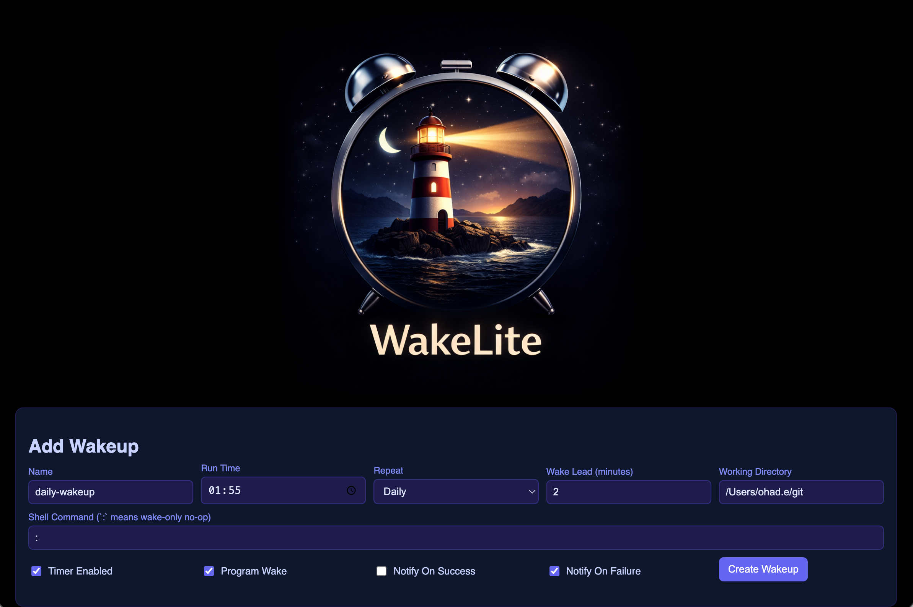
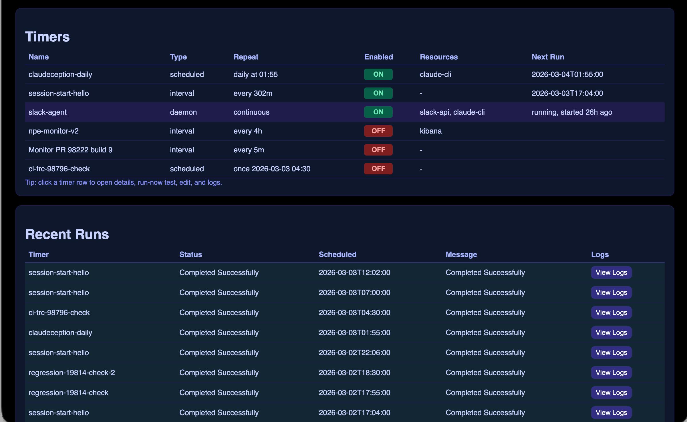

# WakeLite

A reliability-first local scheduler for macOS that wakes your Mac from sleep to run your tasks. Web dashboard, CLI, and terminal callbacks. No PyPI packages at runtime.





## What It Does

- **Schedules commands** on daily, weekly, monthly, interval, or one-off recurrences
- **Wakes your Mac from sleep** before execution via `pmset` — your 2am scripts actually run at 2am
- **Keeps daemons alive** with restart policies and exponential backoff
- **Tracks everything** — run history, stdout/stderr logs, incidents, resource usage
- **Reports back to your terminal** — a finished timer can post its result into the cmux, Ghostty, or WezTerm session that created it
- **Notifies you** via macOS desktop and Slack DMs on success or failure

## Requirements

### Python

Python 3.9 or newer. The package imports only the standard library at runtime, so **you never have to install a PyPI package to run WakeLite**.

The tested floor is stated in `pyproject.toml`; this repository's own test runs use Python 3.14.

### macOS command-line tools

WakeLite shells out to system binaries. All of these ship with macOS, so a normal Mac already has them. They are listed so you know what breaks if one is missing or restricted.

| Binary | Used by | Without it |
|---|---|---|
| `/bin/zsh` | `service.py` — every timer runs as `zsh -lc "<command>"` | No timer can run |
| `pmset` | `reconciler.py` | No wake-from-sleep |
| `launchctl` | `cli.py`, `launchd_install.py`, `doctor.py` | Cannot install, restart, or diagnose the background jobs |
| `osascript` | `notifier.py`, Ghostty callbacks in `service.py` | Desktop-notification fallback and Ghostty injection fail |
| `ps` | `service.py`, `doctor.py` | Orphan reclaim and daemon liveness checks degrade |
| `lsof` | `service.py`, `doctor.py` | Port-holder detection for daemons stops working |
| `sysctl` | `service.py` (`kern.boottime`) | Orphan reclaim cannot tell pre-boot rows apart |
| `route`, `scutil` | `service.py` network probe | Timers may start before the network is up after a boot |
| `security` | `notifier.py` | Slack token cannot be read from the Keychain |

### Optional extras

Each one enables a single feature. Skip any you do not want.

| Extra | Install | Enables |
|---|---|---|
| `rumps` | `.venv/bin/pip install 'wakelite[ui]'` | The menu-bar app (`wakelite-menubar`) |
| WakeLiteNotify.app | `notifier-app/build-app.sh`, then open the app once | Clickable desktop notifications. Building it needs the Xcode command line tools (`xcode-select --install`) |
| `terminal-notifier` | `brew install terminal-notifier` | Second-choice desktop notifier when WakeLiteNotify.app is absent |
| cmux | Install cmux.app | cmux terminal callbacks — see [Terminal callbacks](#terminal-callbacks) |
| `amq` | `brew install avivsinai/tap/amq` | The durable AMQ delivery route for cmux callbacks |
| WezTerm or Ghostty | The respective app | WezTerm or Ghostty terminal callbacks |
| `jq` | `brew install jq` | `wakelite/scripts/wakelite-rollback-cmux-timers.sh` |
| Node.js 18+ | `brew install node` | The dashboard's JavaScript contract test. The dashboard itself does not need Node |
| `pytest` | `.venv/bin/pip install pytest` | The test suite. It is deliberately not a declared dependency |
| Slack bot token | `SLACK_BOT_TOKEN`, or a Keychain entry | Slack notifications. Also set `WAKELITE_SLACK_CHANNEL` |

## Install

WakeLite runs straight from a clone. **Do not `pip install` it into your system or Homebrew Python** — `[project.scripts]` in `pyproject.toml` would put `wakelitectl` and its sibling console scripts onto that interpreter.

```bash
git clone <repo-url> && cd wakelite
python3 -m venv .venv          # optional but recommended; the wrappers find it automatically
./bin/wakelitectl --help
```

The wrappers in `bin/` set `PYTHONPATH` to the repository root and prefer `.venv/bin/python` when it exists, falling back to whatever `python3` is on your `PATH`. So `./bin/wakelitectl` needs no environment setup and no `PYTHONPATH=` prefix.

You still need `PYTHONPATH` when you bypass the wrappers. The test suite needs it from anywhere, and `python3 -m wakelite.cli` needs it whenever your working directory is not the repository root:

```bash
PYTHONPATH=. .venv/bin/python -m pytest tests/ -v
PYTHONPATH=/path/to/wakelite python3 -m wakelite.cli timer list
```

Data lives in `~/.wakelite/` (timers, SQLite state, logs). Set `WAKELITE_HOME` to relocate it. Never copy another machine's `~/.wakelite/` — it holds that machine's live timers.

## Run It

### Foreground

```bash
./bin/wakelitectl serve
open http://127.0.0.1:17341/ui
```

The runner is the single source of truth: it owns the scheduler loop, the REST API on port `17341`, and the web dashboard at `/ui`. Every other component is a client of that API.

### Always on (recommended)

Install the runner as a launchd **user** agent. No `sudo`, and it does not touch any other account on the Mac.

```bash
./bin/wakelitectl launchd install --scope user --load
./bin/wakelitectl launchd status
./bin/wakelitectl health
```

**Clone somewhere permanent first.** The generated plist hardcodes the absolute
path of this checkout, so installing from `/tmp` leaves launchd pointing at a
directory macOS will delete. Move the clone and rerun `launchd install` if you
already did that. To undo an install entirely: `./bin/wakelitectl launchd uninstall --scope user`.

After you change the code, restart it. This purges `__pycache__` and kickstarts the job:

```bash
./bin/wakelitectl launchd restart
```

### Wake-from-sleep (system daemon)

Hardware wakes need root, because only root can program `pmset`. The reconciler reads `~/.wakelite/wake-intents.json`, which the runner writes, and reconciles it with `pmset schedule` every 10 minutes.

```bash
sudo ./bin/wakelitectl launchd install --scope system --load
pmset -g sched    # should list wake entries owned by com.wakelite
```

The reconciler resolves the owning user's `WAKELITE_HOME` from the owner of the script file, so there are no hardcoded home paths. Note that `bin/wakelite-reconciler` always executes `python3` rather than the virtual environment, because root has a different `PATH`.

You can preview what it would do without installing anything:

```bash
./bin/wakelitectl reconcile --once --dry-run
```

## CLI Reference

`./bin/wakelitectl <command>`. Every mutating operation takes `--idempotency-key`: the same key replayed within 24 hours returns the original result instead of repeating the action.

### Service

| Command | Purpose |
|---|---|
| `serve [--tick-seconds N]` | Run the scheduler, REST API, and dashboard in the foreground |
| `health` | Service health as JSON from the REST API. Needs a running runner |
| `doctor` | Full diagnosis — see [doctor](#diagnose-doctor) |
| `reconcile [--once] [--dry-run] [--interval N]` | Run the wake reconciler directly |

### Timers

| Command | Purpose |
|---|---|
| `timer list` | All timers with their next run |
| `timer create --file <path\|-> --idempotency-key K` | Create from a JSON payload; `-` reads stdin |
| `timer update <id> [--file F] [--name N] [--comment C] [--shell S] [--enabled BOOL]` | Edit by file or inline flags |
| `timer enable <id> --idempotency-key K` | Enable |
| `timer disable <id> --idempotency-key K` | Disable |
| `timer delete <id> --idempotency-key K` | Delete. Takes the timer UUID, not the name |
| `timer run-now <id> --idempotency-key K` | Fire once immediately, off schedule |
| `timer clone <id> [--name N] [--patch-file F]` | Copy an existing timer |
| `timer from-template <template> --name N ...` | Create from a bundled template |
| `template list` / `template show <name>` | Browse the templates |

### Runs and incidents

| Command | Purpose |
|---|---|
| `runs list [--limit N] [--timer-id ID]` | Run history |
| `runs logs <run_id>` | stdout and stderr for one run |
| `runs abort <run_id> --idempotency-key K` | Kill a running command |
| `incidents list` / `incidents summary` | Open incidents, and the breakdown by type and timer |
| `incidents ack <id>` / `incidents ack-all` | Resolve incidents |
| `incidents mute list\|add\|rm` | Ignore rules for known-noisy sources |

### launchd

| Command | Purpose |
|---|---|
| `launchd install [--scope user\|system\|both] [--load]` | Install the plists. `--scope system` requires `sudo` |
| `launchd uninstall [--scope ...] [--unload]` | Remove them |
| `launchd status` | Job state for both scopes |
| `launchd restart` | Purge `__pycache__` and kickstart the runner |

## Create a Timer

```bash
./bin/wakelitectl timer create --file - --idempotency-key my-first-timer <<'EOF'
{
  "name": "morning-check",
  "comment": "Run health check every morning",
  "recurrence": {"frequency": "daily", "time": "09:00"},
  "command": {"mode": "shell", "shell": "curl -sf https://example.com/health"},
  "wake": {"enabled": true, "leadMinutes": 2},
  "notifications": {"onFailure": true, "slackActivity": true}
}
EOF
```

Or use the dashboard — fill in the "Add Wakeup" form at the top and click **Create Wakeup**. No JSON required.

The full schema, every field, and all recurrence types are in [`docs/API.md`](docs/API.md). Timer-authoring traps that cost real debugging time are in [`.claude/rules/timer-authoring-gotchas.md`](.claude/rules/timer-authoring-gotchas.md).

## Terminal Callbacks

A timer can post its result back into the terminal session that created it. This closes the loop on "start a long poll, walk away, get the answer where you were working". Three callback types are supported: `cmux`, `ghostty`, and `wezterm`.

### How capture works

`auto_capture_terminal()` in `wakelite/config.py` runs when a timer is created, from both the CLI and the REST API. It checks cmux first, then `$GHOSTTY_TERMINAL_ID`, then `$WEZTERM_PANE`. You do not set the callback type by hand.

### cmux

cmux capture needs **both** `$CMUX_WORKSPACE_ID` and `$CMUX_SURFACE_ID` (`$CMUX_PANEL_ID` is accepted as an alias for the second). If only one is present, the callback is rejected and detection falls through to Ghostty and WezTerm. That rule exists because a `CMUX_SURFACE_ID` leaked from a parent process would otherwise produce a half-filled callback that only fails later, at delivery time.

Capture also records `$CMUX_SOCKET_PATH` and the first cmux CLI it finds. The CLI is resolved from `$CMUX_BUNDLED_CLI_PATH`, then `/opt/homebrew/bin/cmux`, `/usr/local/bin/cmux`, and `/Applications/cmux.app/Contents/Resources/bin/cmux` — deliberately **not** from `PATH`, because unrelated toolchains ship a binary with the same name.

`session_id` is not captured from the environment. A caller that wants resume and AMQ identity has to pass it. When a new cmux timer is created with a non-empty `session_id`, `callback.amq` defaults to `true`, because the AMQ route survives a terminal that has gone away. This default applies at creation only — clone and `from-template` count as creation. An explicit `false` is preserved, and timers already on disk are never opted in silently.

`wakelite/timer_store.py` validates the stored shape. `callback.amq` is valid only on `cmux`. An unknown `callback.type` is neutralized with a warning rather than rejected, so rolling back to an older WakeLite does not brick existing timers.

### What happens when a cmux timer finishes

`_cmux_callback()` in `wakelite/service.py` runs this sequence:

1. Write a recovery signal file first, to `~/.wakelite/<session>.<run>.wakelite-callback.json`. The file is the durable data channel; terminal injection is only the trigger.
2. If `callback.amq` is true and `WAKELITE_AMQ_CALLBACK_ENABLED` is not disabled, resolve the live surface through `~/.cmuxterm/claude-hook-sessions.json` (entries older than 24 hours are ignored), confirm a live AMQ wake with `amq wake check`, then `amq send`. On success the signal file is deleted and delivery is done.
3. Otherwise inject through the cmux CLI: `send` with the text, then `send-key Enter`. cmux does not treat a trailing newline as Enter, so the second call is required. A stale workspace or surface triggers a retarget through the session store, and then a `new-workspace` plus `claude --resume <session_id>` fallback.
4. The outcome is recorded as `amq-sent`, `fallback-delivered`, or `delivery-failed`.

Callbacks fire on `success` and `failed` only — never on exit code 75 ("waiting") and never on an aborted run.

### Rolling cmux callbacks back

If a cmux version changes under you, stop the injection without editing timers by hand:

```bash
wakelite/scripts/wakelite-rollback-cmux-timers.sh --list
wakelite/scripts/wakelite-rollback-cmux-timers.sh --neutralize
wakelite/scripts/wakelite-rollback-cmux-timers.sh --rewrite ghostty
```

It needs `jq` and a reachable `wakelitectl`.

### Ghostty and WezTerm

Both inject directly into `$GHOSTTY_TERMINAL_ID` or `$WEZTERM_PANE` and have no AMQ route; setting `callback.amq` on them is a validation error. If the terminal is gone, WakeLite sends a Slack DM and opens a new tab running `claude --resume <session_id>`.

## Diagnose (`doctor`)

```bash
./bin/wakelitectl doctor            # heartbeat, daemons, ports, failing timers, incidents
./bin/wakelitectl doctor --json     # same report, machine-readable
./bin/wakelitectl doctor --fix      # reclaim orphans; kickstart a stale runner
./bin/wakelitectl doctor --quiet    # silent when healthy — safe to run on a schedule
./bin/wakelitectl doctor --watchdog # implies --fix --quiet; used by the watchdog launchd job
```

`doctor` is the first command to run when anything looks wrong. Unlike every other subcommand it falls back to reading `~/.wakelite/state.db` directly when the REST API does not answer, because a hung runner is exactly the case where the API stops answering. Exit code is `0` when healthy and `1` when the report lists problems.

`--fix` does exactly two things and records an incident for each: reclaim orphaned daemon children, and `launchctl kickstart -k` the runner when the heartbeat is stale. The kick is capped at one per 30 minutes. After two kicks in two hours fail to restore the heartbeat it raises one critical incident and stops kicking.

To have `doctor` check a daemon's port, declare it as a resource named `port:17382`, or name the resource anything containing "port" and put the number in its description.

## Features

- **Timer types**: Scheduled (one-shot on recurrence) and Daemon (long-lived, kept alive)
- **Recurrence**: daily, weekly, monthly, one-off, interval (with active-hours windowing)
- **Wake-from-sleep**: `pmset` scheduling with configurable lead time
- **Execution controls**: overlap policy (skip/queue/allow), max concurrency, restart with exponential backoff
- **Run lifecycle**: `until` conditions (auto-delete on success/failure), `max_runs` limit (auto-disable)
- **Exit code 75**: BSD `EX_TEMPFAIL` — polling scripts return "waiting" (blue rows) instead of "failed" (red rows)
- **Notifications**: macOS desktop and Slack DMs, global mute toggle
- **Resources**: time-axis capacity tracking that blocks a create or update only when timers actually overlap in time
- **Terminal callbacks**: cmux, Ghostty, and WezTerm, with a durable AMQ route and a signal-file recovery channel
- **Incidents**: auto-detection of repeated failures, with a dashboard report at `/ui#incidents` — breakdown by type and timer, daily trend, per-incident resolve, filtered bulk resolve, and ignore rules
- **Web dashboard**: real-time status, inline editing, run-now, abort, log viewing — installable as a PWA (Chrome → "Install page as app")
- **Idempotency**: every create, update, and delete requires a caller-chosen key
- **Crash recovery**: missed-run catch-up, uncertain-run marking, orphan reclaim by process start time

## Testing

```bash
python3 -m venv .venv
.venv/bin/pip install pytest
PYTHONPATH=. .venv/bin/python -m pytest tests/ -v
```

`pytest` is intentionally not a declared dependency, so install it inside the virtual environment rather than globally. Node.js 18+ is needed only for `tests/test_ui_health_contract.py`, which runs the dashboard's inline JavaScript contract tests.

## Configuration

Everything machine-specific is an environment variable with a safe default. Nothing needs editing to run WakeLite on your own Mac.

| Variable | Default | Purpose |
|---|---|---|
| `WAKELITE_HOME` | `~/.wakelite` | Timer store, SQLite state, and run logs |
| `WAKELITE_SLACK_CHANNEL` | unset | Slack channel or DM id to notify. **Unset means Slack is off** — WakeLite never posts anywhere you did not name |
| `SLACK_BOT_TOKEN` | unset | Slack token. Checked before the Keychain |
| `WAKELITE_KEYCHAIN_SERVICE` | `wakelite-slack-bot-token` | Keychain item holding the Slack token |
| `WAKELITE_KEYCHAIN_ACCOUNT` | `wakelite` | Keychain account for that item |
| `DAILY_MERGE_AUTHOR_PATTERN` | unset | Case-insensitive regex of commit authors `daily-merge-stable.sh` may auto-merge. **Unset means no author is trusted**, so every branch escalates instead |

Store the Slack token like this:

```bash
security add-generic-password -s wakelite-slack-bot-token -a wakelite -w <token>
export WAKELITE_SLACK_CHANNEL=C0123ABCD
```

One thing is still hardcoded: `AMQ_BINARY_PATH` in `wakelite/config.py` points at `/opt/homebrew/bin/amq`. An Intel Mac needs `/usr/local/bin/amq`.

## Docs

- **[`docs/API.md`](docs/API.md)** — full timer schema, field reference, recurrence types, execution controls, REST API reference, callback fields
- **[`.claude/rules/timer-authoring-gotchas.md`](.claude/rules/timer-authoring-gotchas.md)** — schema traps, interval and daemon rules, callback behaviour
- **[`CLAUDE.md`](CLAUDE.md)** — architecture, module map, and the reasoning behind the capacity gate, the boot-window network wait, and orphan reclaim

## License

MIT. See [LICENSE](LICENSE).
